# Diagrama de flujo del experimento de branching adaptativo

```mermaid
flowchart TD
    A([Inicio]) -->|Iniciar el protocolo| B[Definir modelo, benchmark<br/>y configuracion experimental]

    B -->|Fijar Qwen, HumanEval,<br/>semillas y presupuesto| C[Generar solucion baseline<br/>mediante decoding greedy]

    C -->|Ejecutar la solucion inicial| D{El baseline<br/>falla los tests?}

    D -->|No: ya resuelve el problema| E[Descartar el problema<br/>de la cohorte]
    E -->|Evaluar el siguiente problema| C

    D -->|Si: es candidato a recuperacion| F{Tiene al menos cinco<br/>posiciones elegibles?}

    F -->|No: no admite el presupuesto comun| E
    F -->|Si: cumple los criterios| G[Agregar el problema<br/>a la cohorte]

    G -->|Contabilizar un fallo elegible| H{Se reunieron<br/>20 problemas?}

    H -->|No: continuar construyendo la cohorte| C
    H -->|Si: congelar la cohorte| I[Generar lookahead top-2 de 12 tokens<br/>en cada posicion elegible]

    I -->|Observar el efecto temprano<br/>de cada bifurcacion| J[Calcular las senales de seleccion]

    J -->|Medir divergencia de la continuacion| K1[Lookahead semantico]
    J -->|Medir incertidumbre global| K2[Entropia]
    J -->|Comparar probabilidades top-1 y top-2| K3[Margen top-1 / top-2]
    J -->|Crear el control de referencia| K4[Control aleatorio]

    K1 -->|Ordenar por score semantico| L[Seleccionar cinco posiciones<br/>por politica y problema]
    K2 -->|Ordenar por mayor entropia| L
    K3 -->|Ordenar por menor margen| L
    K4 -->|Muestrear con semilla fija| L

    L -->|Aplicar el mismo presupuesto<br/>a todos los selectores| M[Forzar el token top-2<br/>en cada posicion seleccionada]

    M -->|Crear una trayectoria alternativa| N[Continuar la generacion<br/>de forma greedy]

    N -->|Completar el programa alternativo| O[Ejecutar tests de HumanEval]

    O -->|Registrar PASS o FAIL por rama| P{Alguna rama<br/>pasa los tests?}

    P -->|Si: existe una reparacion top-2| Q[Problema recuperado]
    P -->|No: ninguna rama seleccionada funciona| R[Problema no recuperado]

    Q -->|Contabilizar una recuperacion| S[Agregar resultados<br/>por selector y presupuesto]
    R -->|Contabilizar una no recuperacion| S

    S -->|Calcular tasas y curvas para k=1 a 5| T[Comparar las cuatro politicas]

    T -->|Resultado del selector semantico| U[Semantico: 10 de 20]
    T -->|Resultado del selector probabilistico| V[Entropia: 10 de 20]
    T -->|Resultado del margen probabilistico| W[Margen: 10 de 20]
    T -->|Resultado del control| X[Aleatorio: 6 de 20]

    U -->|Incorporar al resumen| Y[Registrar resultados<br/>en Google Sheets]
    V -->|Incorporar al resumen| Y
    W -->|Incorporar al resumen| Y
    X -->|Incorporar al resumen| Y

    Y -->|Documentar resultados y metodologia| Z([Fin])

    classDef process fill:#e8f1ff,stroke:#3976c2,color:#14263d;
    classDef decision fill:#fff3d9,stroke:#c68a19,color:#49320a;
    classDef result fill:#eaf7ee,stroke:#3b8f5a,color:#153522;

    class B,C,E,G,I,J,K1,K2,K3,K4,L,M,N,O,S,T,Y process;
    class D,F,H,P decision;
    class Q,R,U,V,W,X result;
```

## Explicación de las decisiones y mediciones

### 1. ¿Qué significa que una posición sea elegible?

Primero se genera el programa completo con el baseline greedy. Una posición es elegible cuando cumple estas condiciones:

- no está dentro de los dos primeros tokens de la generación (`edge buffer = 2`);
- después de esa posición quedan al menos 12 tokens del baseline;
- por lo tanto, se puede comparar en todas las posiciones una ventana completa y de igual longitud: los 12 tokens del baseline contra los 12 tokens de la rama top-2.

En el código, para una generación de `N` tokens, las posiciones elegibles son las comprendidas entre `2` y `N - 12`. El problema se incluye en la cohorte solamente si el baseline falla los tests y existen al menos cinco posiciones elegibles. Se exigen cinco porque ése es el presupuesto máximo de ramas asignado a cada selector; de otro modo, la comparación no tendría el mismo presupuesto en todos los problemas.

### 2. ¿Por qué se generan solamente 12 tokens de lookahead?

El lookahead es una exploración corta, no la rama definitiva. En cada posición se fuerza el token top-2 y se generan 12 tokens para observar si la decisión alternativa cambia la trayectoria del programa.

La ventana de 12 tokens busca un compromiso:

- es suficientemente larga para observar si el cambio persiste y modifica operadores, palabras clave, llamadas o literales;
- es mucho más barata que completar una rama desde cada una de las 1.649 posiciones;
- permite usar la misma cantidad de información en todas las posiciones y compararlas de forma uniforme.

Después del ranking se evalúan hasta cinco ramas por política y problema. Como algunas posiciones son compartidas entre políticas, se generaron 255 ramas completas únicas en la validación. Los 12 tokens constituyen un hiperparámetro congelado a partir del experimento de desarrollo; esta validación no demuestra que 12 sea la longitud óptima.

### 3. ¿Por qué se mide la divergencia semántica?

La entropía y el margen describen la incertidumbre local del modelo en un único token. No indican cuánto cambia el programa después de tomar la alternativa. La divergencia semántica intenta medir el efecto que produce la bifurcación sobre la continuación.

El score semántico combina, con el mismo peso, tres componentes convertidos a percentiles dentro de cada problema:

1. **Persistencia después del token forzado:** durante cuántos tokens continúa siendo diferente la rama top-2 respecto del baseline.
2. **Divergencia semántica ponderada:** da más importancia a cambios de keywords, operadores, identificadores o literales que a diferencias superficiales.
3. **Anchor score:** detecta cambios en elementos estructurales del código, como llamadas, métodos, operadores y números.

La finalidad es priorizar bifurcaciones que puedan cambiar el algoritmo o la estructura del programa, aunque el modelo estuviera muy seguro del token top-1.

### 4. ¿Cómo funciona el control aleatorio?

Para cada problema se toman cinco posiciones distintas al azar entre todas las posiciones elegibles, sin reemplazo. La selección utiliza una semilla fija derivada del identificador del problema, por lo que es reproducible.

El control aleatorio responde a esta pregunta: **¿cuántos problemas recuperaríamos si gastáramos las mismas cinco ramas, pero sin utilizar ninguna señal inteligente para elegir las posiciones?** Así se puede saber si los selectores aportan información o si el resultado se debe solamente a probar varias ramas.

### 5. Políticas comparadas con el mismo presupuesto

Cada política ordena o elige cinco posiciones por problema:

| Política | Qué mide | Cómo selecciona |
|---|---|---|
| Semántica | Efecto de la alternativa sobre los siguientes 12 tokens | Mayor score semántico |
| Entropía | Incertidumbre de toda la distribución del siguiente token | Mayor entropía |
| Margen | Cercanía entre las probabilidades de top-1 y top-2 | Menor margen |
| Aleatoria | Ninguna señal; funciona como control | Cinco posiciones al azar con semilla fija |

El presupuesto `k` indica cuántas ramas completas se permite probar por política y problema. Se informa la curva para `k = 1, 2, 3, 4 y 5`, tomando las primeras `k` posiciones de cada ranking.

### 6. ¿Qué tasas y curvas se miden?

La métrica principal es la **recuperación por problema**. Un problema se considera recuperado cuando al menos una de las primeras `k` ramas seleccionadas pasa los tests.

| Presupuesto `k` | Semántico | Entropía | Margen | Aleatorio |
|---:|---:|---:|---:|---:|
| 1 rama | 5/20 (25%) | 8/20 (40%) | 6/20 (30%) | 4/20 (20%) |
| 2 ramas | 7/20 (35%) | 10/20 (50%) | 8/20 (40%) | 5/20 (25%) |
| 3 ramas | 7/20 (35%) | 10/20 (50%) | 10/20 (50%) | 6/20 (30%) |
| 4 ramas | 8/20 (40%) | 10/20 (50%) | 10/20 (50%) | 6/20 (30%) |
| 5 ramas | 10/20 (50%) | 10/20 (50%) | 10/20 (50%) | 6/20 (30%) |

Esta curva muestra cuántos problemas se recuperan a medida que aumenta el costo computacional. Por ejemplo, entropía recupera 8 problemas con una sola rama y llega a 10 con dos; el selector semántico necesita cinco ramas para llegar a 10.

También se miden:

- **Ramas PASS:** cantidad de ramas individuales que pasan los tests. Semántico obtuvo 15, entropía 21, margen 21 y aleatorio 7.
- **Precisión de rama:** ramas PASS divididas por las 100 ramas nominales de cada política. Los valores son 15%, 21%, 21% y 7%, respectivamente. Indica cuán densas son las ramas útiles, no cuántas posiciones útiles existen en total.
- **Intervalo de Wilson del 95%:** refleja la incertidumbre de la tasa de recuperación con sólo 20 problemas. Para 10/20 es aproximadamente 30%–70%; para 6/20, 15%–52%.
- **Comparación pareada de McNemar:** compara qué problemas recupera una política y no la otra. Semántico y entropía recuperaron nueve problemas en común, uno exclusivo cada uno y fallaron juntos en nueve (`p = 1,0`).

### 7. ¿Qué significan los resultados finales?

- **Semántico 10/20:** recuperó el 50% de los problemas fallados por el baseline usando hasta cinco ramas, pero necesitó más presupuesto que entropía para alcanzar ese valor.
- **Entropía 10/20:** también recuperó el 50% y fue el mejor selector con presupuestos de una y dos ramas.
- **Margen 10/20:** alcanzó el mismo resultado final y seleccionó posiciones muy similares a entropía.
- **Aleatorio 6/20:** probar cinco ramas sin ranking recuperó el 30%. Es la referencia para estimar cuánto aportan las señales de selección.

La conclusión defendible es que cambiar una decisión top-1 por top-2 puede reparar una generación fallida. El selector semántico explora posiciones diferentes y puede aportar diversidad, pero en estos 20 problemas no supera a entropía ni a margen. Los tests se usan después de seleccionar y generar las ramas, no para elegir las posiciones de bifurcación.

### 8. Auditoría y límites de reproducibilidad

La búsqueda inicial produjo 141 baselines, de los cuales 21 fallaron. La validación congelada seleccionó una cohorte de 20 fallos elegibles, tal como establece el protocolo; por eso el denominador de las tasas de recuperación es 20 y no 21.

La auditoría posterior detectó dos posiciones con discrepancias en la identificación del rango top-2 entre pasadas debido a pequeñas diferencias numéricas. Ninguna de esas posiciones fue necesaria para cambiar las tasas agregadas reportadas. También se observó que un desempate basado directamente en scores de punto flotante puede variar por diferencias cercanas a `10^-16`. En una réplica futura, los rangos deberán representarse como enteros o los scores deberán cuantizarse antes de aplicar el desempate determinista.

Estos resultados deben interpretarse como una validación exploratoria sobre 20 problemas y un modelo específico. No demuestran superioridad general del selector semántico ni equivalencia de costo computacional entre las políticas.
